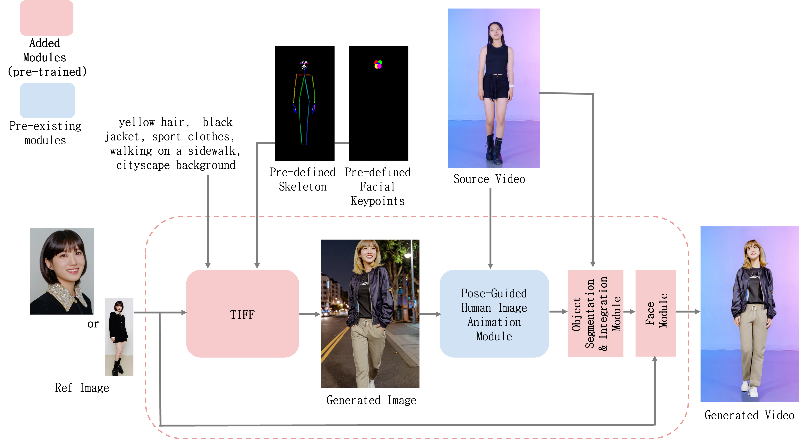
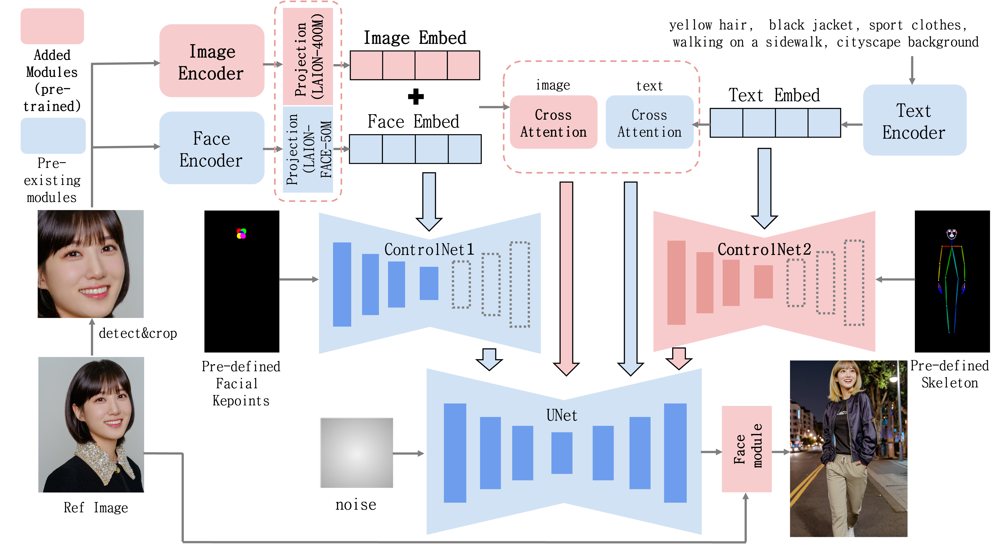
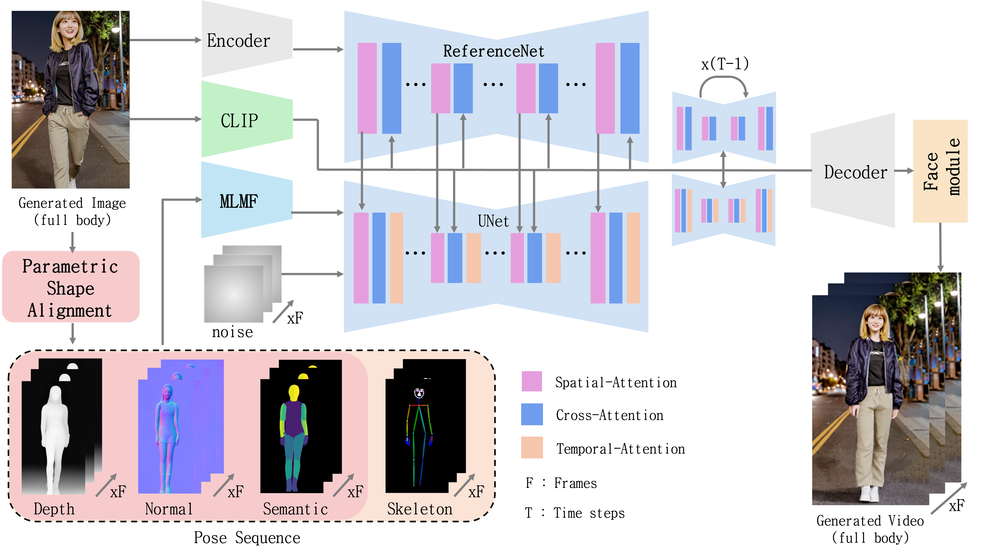

# TIFF

TIFF: Text-Guided Generation of Full-Body Image with Preserved Reference Face for Customized Animation

Python implementation

**[Jaechan Jo](mailto:jjc123a@naver.com)**

✨ **This is an example of animated characters referencing Korean actors Park Eun-bin, Park Seo-joon, and Park So-yi.** ✨

https://github.com/jaechanjo/TIFF/assets/89237860/a9fabb80-350c-41f2-9d84-6bdaf4c0aecf

### Performace by method
1. Performance comparison of generated images between existing methods and TIFF.

| Method         | L1↓   | Cos Dist.↓ | LPIPS↓ | SSIM↑  | PSNR↑  |
|----------------|-------|-------------|--------|--------|--------|
| LoRA           | 1.169 | 0.845       | 0.750  | 0.426  | 11.106 |
| InstantID      | 1.064 | 0.694       | 0.762  | 0.368  | 10.666 |
| **TIFF(Ours)**     | **0.892** | **0.478**       | **0.691**  | **0.431**  | **12.406** |
| Ref Image(GT)  | 0.838 | 0.419       | 0.386  | 0.546  | inf.   |

2. Performance comparison of generated videos between existing methods and TIFF.

| Method         | L1↓   | Cos Dist.↓ | LPIPS↓ | SSIM↑  | PSNR↑  |
|----------------|-------|-------------|--------|--------|--------|
| LoRA           | 1.251 | 0.969       | 0.773  | 0.434  | 10.424 |
| InstantID      | 1.222 | 0.924       | 0.785  | 0.397  | 10.869 |
| **TIFF(Ours)**     | **0.967** | **0.568**       | **0.723**  | **0.438**  | **12.293** |
| Ref Video(GT)  | 0.950 | 0.519       | 0.605  | 0.442  | 11.315 |

## Method Overview
1. The System Architecture for Generating Customized Animations with TIFF and Face Module.

2. The architecture of proposed TIFF and Face Module.

3. The Architecture of [Champ](https://github.com/fudan-generative-vision/champ) Enhanced with the Face Module for Improved Facial Details. 

## Evaluation

For installation instructions, see the link below.

[HowToEval](docs/HowToEval.md)

## Setup

For Setup instructions, see the link below.

[HowToSetup](docs/HowToSetup.md)

## Usage

For Usage instructions, see the link below.

[HowToUse](docs/HowToUse.md)

## Others

- This implementation was developed by **[Jaechan Jo](mailto:jjc123a@naver.com)** 

If you have any problem or error during running code, please email to us or submit an issue.
